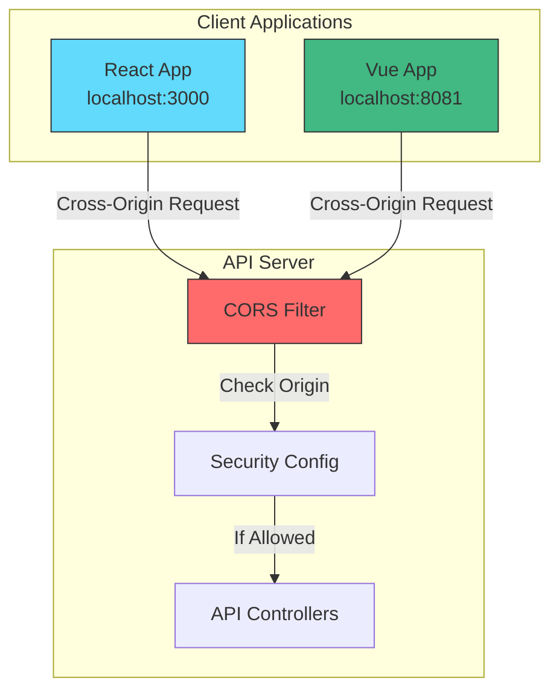
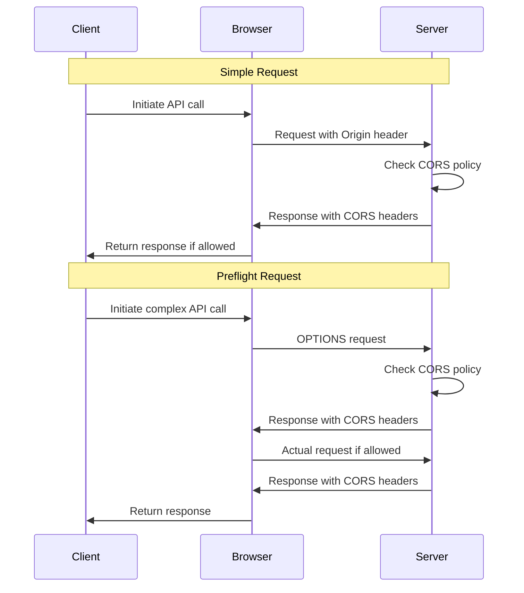
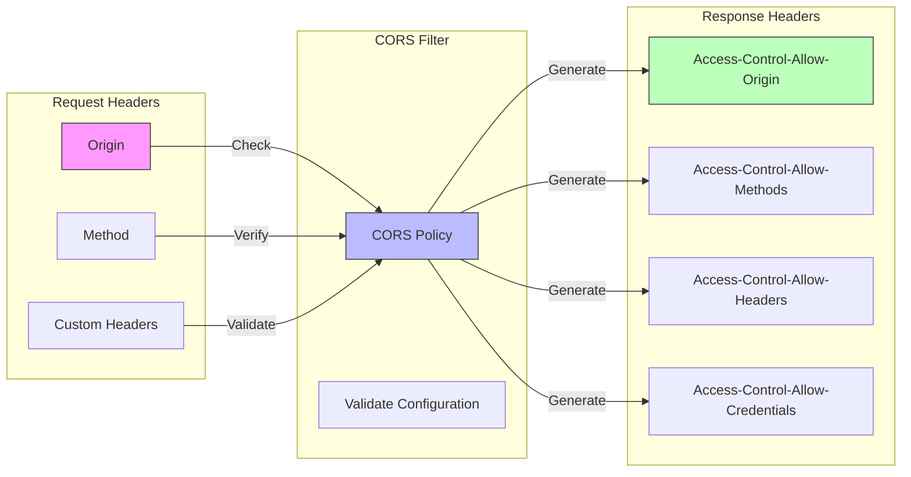

# CORS Configuration Demo

## Learning Objectives
By the end of this tutorial, you will:
1. Understand CORS and its importance in web security
2. Learn how to implement CORS in Spring Boot applications
3. Master best practices for cross-origin security
4. Build a secure API with proper CORS configuration

## Project Structure
```
cors-protection/
├── src/
│   ├── main/
│   │   ├── java/
│   │   │   └── com/
│   │   │       └── example/
│   │   │           └── cors/
│   │   │               ├── CorsProtectionApplication.java
│   │   │               ├── config/
│   │   │               │   └── SecurityConfig.java
│   │   │               ├── controller/
│   │   │               │   ├── ResourceController.java
│   │   │               │   └── AuthController.java
│   │   │               ├── model/
│   │   │               │   └── ApiResponse.java
│   │   │               └── service/
│   │   │                   └── ResourceService.java
│   │   └── resources/
│   │       ├── static/
│   │       │   ├── css/
│   │       │   │   └── styles.css
│   │       │   └── js/
│   │       │       └── main.js
│   │       └── application.properties
│   └── test/
│       └── java/
│           └── com/
│               └── example/
│                   └── cors/
│                       └── CorsProtectionTests.java
├── pom.xml
└── README.md
```

## Architecture Overview



## Implementation Guide

### Step 1: Configure CORS in Spring Security

```java
@Configuration
@EnableWebSecurity
public class SecurityConfig {
    @Bean
    public SecurityFilterChain filterChain(HttpSecurity http) throws Exception {
        http
            .cors(cors -> cors
                .configurationSource(corsConfigurationSource()))
            .csrf(csrf -> csrf.disable())
            .authorizeHttpRequests(auth -> auth
                .requestMatchers("/api/public/**").permitAll()
                .anyRequest().authenticated()
            );
        return http.build();
    }

    @Bean
    public CorsConfigurationSource corsConfigurationSource() {
        CorsConfiguration configuration = new CorsConfiguration();
        
        // Allow specific origins
        configuration.setAllowedOrigins(Arrays.asList(
            "http://localhost:3000",
            "http://localhost:8081"
        ));
        
        // Allow specific methods
        configuration.setAllowedMethods(Arrays.asList(
            "GET", "POST", "PUT", "DELETE", "OPTIONS"
        ));
        
        // Allow specific headers
        configuration.setAllowedHeaders(Arrays.asList(
            "Authorization",
            "Content-Type",
            "X-Requested-With"
        ));
        
        // Allow credentials (cookies, authorization headers)
        configuration.setAllowCredentials(true);
        
        // Cache preflight response for 3600 seconds
        configuration.setMaxAge(3600L);

        UrlBasedCorsConfigurationSource source = new UrlBasedCorsConfigurationSource();
        source.registerCorsConfiguration("/api/**", configuration);
        
        return source;
    }
}
```

### Step 2: Create Protected Resources

```java
@RestController
@RequestMapping("/api")
public class ResourceController {
    
    @GetMapping("/public/data")
    public ResponseEntity<?> getPublicData() {
        return ResponseEntity.ok(
            new ApiResponse("success", "Public data accessed")
        );
    }
    
    @GetMapping("/protected/data")
    public ResponseEntity<?> getProtectedData() {
        return ResponseEntity.ok(
            new ApiResponse("success", "Protected data accessed")
        );
    }
    
    @PostMapping("/protected/update")
    public ResponseEntity<?> updateData(@RequestBody UpdateRequest request) {
        // Process update
        return ResponseEntity.ok(
            new ApiResponse("success", "Data updated successfully")
        );
    }
}
```

### Step 3: Frontend Implementation

```javascript
// React/Vue client implementation
class ApiClient {
    static async fetchPublicData() {
        const response = await fetch('http://localhost:8080/api/public/data', {
            method: 'GET',
            credentials: 'include', // Important for CORS with credentials
            headers: {
                'Content-Type': 'application/json'
            }
        });
        return response.json();
    }
    
    static async fetchProtectedData(token) {
        const response = await fetch('http://localhost:8080/api/protected/data', {
            method: 'GET',
            credentials: 'include',
            headers: {
                'Content-Type': 'application/json',
                'Authorization': `Bearer ${token}`
            }
        });
        return response.json();
    }
    
    static async updateData(token, data) {
        const response = await fetch('http://localhost:8080/api/protected/update', {
            method: 'POST',
            credentials: 'include',
            headers: {
                'Content-Type': 'application/json',
                'Authorization': `Bearer ${token}`
            },
            body: JSON.stringify(data)
        });
        return response.json();
    }
}

// Error handling wrapper
async function makeApiCall(apiFunc) {
    try {
        const response = await apiFunc();
        if (!response.ok) {
            throw new Error(`API call failed: ${response.status}`);
        }
        return response.json();
    } catch (error) {
        console.error('API Error:', error);
        throw error;
    }
}
```

## Testing CORS Configuration

1. **Using cURL**:
```bash
# Test preflight request
curl -X OPTIONS \
     -H "Origin: http://localhost:3000" \
     -H "Access-Control-Request-Method: POST" \
     -H "Access-Control-Request-Headers: Authorization,Content-Type" \
     http://localhost:8080/api/protected/data -v

# Test actual request
curl -X GET \
     -H "Origin: http://localhost:3000" \
     -H "Authorization: Bearer your-token" \
     http://localhost:8080/api/protected/data -v
```

2. **Using Browser Console**:
```javascript
// Test public endpoint
fetch('http://localhost:8080/api/public/data', {
    method: 'GET',
    credentials: 'include'
}).then(response => response.json())
  .then(data => console.log(data));

// Test protected endpoint
fetch('http://localhost:8080/api/protected/data', {
    method: 'GET',
    credentials: 'include',
    headers: {
        'Authorization': 'Bearer your-token'
    }
}).then(response => response.json())
  .then(data => console.log(data));
```

## Common Issues and Solutions

1. **Preflight Failures**
   - Check allowed methods and headers
   - Verify origin is in allowed list
   - Ensure credentials are properly configured

2. **Credential Issues**
   - Set `allowCredentials` to true in CORS config
   - Include `credentials: 'include'` in fetch calls
   - Configure cookie settings properly

3. **Header Problems**
   - Verify `Access-Control-Allow-Headers`
   - Check case sensitivity
   - Include all required custom headers

## Best Practices

1. **Security**
   - Limit allowed origins to known domains
   - Restrict HTTP methods to required ones
   - Minimize exposed headers
   - Use HTTPS in production

2. **Performance**
   - Set appropriate max age for preflight
   - Cache CORS responses
   - Monitor preflight requests

3. **Maintenance**
   - Document CORS configuration
   - Log CORS errors
   - Review allowed origins regularly

## Additional Resources
- [Spring CORS Documentation](https://docs.spring.io/spring-framework/docs/current/reference/html/web.html#mvc-cors)
- [MDN CORS Guide](https://developer.mozilla.org/en-US/docs/Web/HTTP/CORS)
- [OWASP CORS Guidelines](https://owasp.org/www-project-web-security-testing-guide/latest/4-Web_Application_Security_Testing/11-Client_Side_Testing/07-Testing_Cross_Origin_Resource_Sharing)

## Support
Need help? Check out:
- GitHub Issues
- Stack Overflow with tag [spring-cors]
- Spring Security Forum

Remember: CORS is a critical security feature. Always test thoroughly and follow security best practices.

## CORS Request Flow



## CORS Headers Flow



## Features

1. **Flexible CORS Configuration**: 
   - Configure allowed origins, methods, and headers
   - Handle credentials and exposed headers
   - Set max age for preflight responses

2. **Security Best Practices**:
   - Origin validation
   - Method restrictions
   - Header controls
   - Credential handling

3. **Demo Endpoints**:
   - GET /api/data
   - POST /api/submit
   - Automatic OPTIONS handling

## Implementation Details

### 1. CORS Configuration
```java
@Bean
public CorsConfigurationSource corsConfigurationSource() {
    CorsConfiguration configuration = new CorsConfiguration();
    configuration.setAllowedOrigins(Arrays.asList("http://localhost:3000"));
    configuration.setAllowedMethods(Arrays.asList("GET", "POST"));
    // ... more configuration
    return new UrlBasedCorsConfigurationSource();
}
```

### 2. Security Integration
```java
@Bean
public SecurityFilterChain filterChain(HttpSecurity http) {
    http.cors().and()
        // ... more configuration
    return http.build();
}
```

## Testing CORS

1. **Simple Requests**:
```javascript
fetch('http://localhost:8080/api/data', {
    method: 'GET',
    credentials: 'include'
})
```

2. **Preflight Requests**:
```javascript
fetch('http://localhost:8080/api/submit', {
    method: 'POST',
    headers: {
        'Content-Type': 'application/json',
        'Custom-Header': 'value'
    },
    body: JSON.stringify({ data: 'test' })
})
```

## Common CORS Issues and Solutions

1. **Missing Allow-Origin Header**
   - Ensure correct origin configuration
   - Use allowedOrigins or allowedOriginPatterns

2. **Credentials Issues**
   - Set allowCredentials to true
   - Specify exact origin (no wildcards)
   - Include credentials in fetch calls

3. **Method Not Allowed**
   - Configure allowedMethods correctly
   - Handle OPTIONS requests properly

## Best Practices

1. **Security**:
   - Never use `allowedOrigins("*")` with credentials
   - Explicitly list allowed origins
   - Minimize exposed headers

2. **Performance**:
   - Set appropriate maxAge
   - Use pattern matching for similar origins
   - Cache CORS responses

3. **Maintenance**:
   - Document all CORS configurations
   - Monitor CORS errors
   - Regular security audits

## Additional Resources

- [Spring CORS Documentation](https://docs.spring.io/spring-framework/reference/web/webmvc-cors.html)
- [MDN CORS Guide](https://developer.mozilla.org/en-US/docs/Web/HTTP/CORS)
- [OWASP CORS Guide](https://owasp.org/www-project-web-security-testing-guide/latest/4-Web_Application_Security_Testing/11-Client_Side_Testing/07-Testing_Cross_Origin_Resource_Sharing)
