# CORS Protection Guide

## 📚 Table of Contents
1. [Understanding CORS](#understanding-cors)
2. [Learning Objectives](#learning-objectives)
3. [CORS in Action](#cors-in-action)
4. [Implementation Guide](#implementation-guide)
5. [Testing and Validation](#testing-and-validation)
6. [Best Practices](#best-practices)
7. [Additional Resources](#additional-resources)

## Understanding CORS

### What is CORS?
Cross-Origin Resource Sharing (CORS) is a security feature implemented in web browsers to control how web pages can request resources from a different domain than the one that served the web page. It uses HTTP headers to tell browsers whether a specific web app can share resources with another web app from a different origin.

### The House Security Analogy 🏠

Think of CORS like a security system for your house:


### CORS vs. CSRF
While both deal with cross-origin security:
- **CORS**: Acts like a fence, controlling which external applications can access your banking API
- **CSRF**: Acts like a lock, preventing unauthorized transactions using your banking credentials

### Real-World Example: Modern Banking

Imagine a banking system (`mybank.com`) that provides financial services:

1. **Trusted Partners**:
   - Mobile Banking App (`mybank-mobile.com`)
   - Financial Planning App (`mybank-planner.com`)
   - Investment Dashboard (`mybank-invest.com`)

2. **Security Needs**:
   - Allow access from trusted partner applications
   - Block unauthorized access from unknown sources
   - Protect sensitive financial data
   - Enable secure transactions

### Key Concepts
- **Origin**: Protocol + Domain + Port (e.g., `https://mybank.com:443`)
- **Same-Origin**: Requests within the same banking domain are always allowed
- **Cross-Origin**: Requests from partner applications need explicit permission

## Learning Objectives
By completing this guide, you will:
1. Understand CORS and its importance in web security
2. Learn how to implement CORS in Spring Boot applications
3. Master best practices for cross-origin security
4. Build a secure banking API with proper CORS configuration

## CORS in Action

### Architecture Overview


### Request Flow Examples

Let's examine how CORS handles different types of origins in a banking context:

#### Scenario 1: Same-Origin Request (No CORS Needed)
When a customer uses the main banking portal to check their balance:

```mermaid
sequenceDiagram
    participant MB as Main Banking Portal<br/>(mybank.com)
    participant B as Browser
    participant API as Banking API<br/>(mybank.com/api)
    
    Note over MB,API: Same-Origin Request (mybank.com → mybank.com/api)
    MB->>B: User clicks "Check Balance"
    B->>API: GET /api/banking/balance<br/>Origin: https://mybank.com
    Note over API: No CORS check needed<br/>Same origin: mybank.com
    API->>B: 200 OK<br/>Balance: $1,000
    B->>MB: Display balance to user
```



#### Scenario 2: Cross-Origin Request (CORS Required)
When a partner application needs to access banking data:


### Headers Flow Explained

This diagram shows how CORS validates different origins:

```mermaid
graph TB
    subgraph "1.Origin Analysis"
        SO[Same Origin:<br/>  https:// mybank.com:443<br/>↓<br/> https:// mybank.com:443/api]
        CO[Cross Origin:<br/> https:// mybank-partner.com:443<br/>↓<br/> https:// mybank.com:443]
    end

    subgraph "2.CORS Security Check"
        CP[CORS Policy Validation]
        VC[Validation Rules:<br/>1.Protocol-https<br/>2.Domain-mybank.com<br/>3.Port:443]
    end

    subgraph "3.Response Headers"
        AO[Access-Control-Allow-Origin:<br/>Specific origin or *]
        AM[Access-Control-Allow-Methods:<br/>Allowed HTTP methods]
        AC[Access-Control-Allow-Credentials:<br/>Cookie handling]
    end

    SO --No CORS Required-->CP
    CO --Requires CORS Check-->CP
    CP --If Origin Matches-->AO
    CP --If Methods Allowed-->AM
    CP --If Credentials Needed-->AC

    style SO fill:#bfb,stroke:#333
    style CO fill:#f9f,stroke:#333
    style CP fill:#bbf,stroke:#333
```



This flow demonstrates:
1. **Same-Origin**: Requests within `mybank.com` domain are automatically allowed
2. **Cross-Origin**: Partner applications need explicit CORS permission
3. **Origin Components**: How protocol (https), domain (mybank.com), and port (443) affect CORS policy
4. **Security Checks**: Different validation steps for cross-origin requests

## Implementation Guide

### Backend Configuration

```java
@Configuration
@EnableWebSecurity
public class SecurityConfig {
    @Bean
    public SecurityFilterChain filterChain(HttpSecurity http) throws Exception {
        http
            .cors(cors -> cors
                .configurationSource(corsConfigurationSource()))
            .csrf(csrf -> csrf.disable())
            .authorizeHttpRequests(auth -> auth
                .antMatchers("/api/banking/balance", "/api/banking/transfer").permitAll()
                .anyRequest().authenticated()
            );
        return http.build();
    }

    @Bean
    public CorsConfigurationSource corsConfigurationSource() {
        CorsConfiguration configuration = new CorsConfiguration();
        configuration.setAllowedOrigins(Arrays.asList(
            "http://localhost:3000",
            "http://localhost:3001",
            "http://localhost:3002"
        ));
        configuration.setAllowedMethods(Arrays.asList("GET", "POST", "PUT", "DELETE", "OPTIONS"));
        configuration.setAllowedHeaders(Arrays.asList("Authorization", "Content-Type", "X-Requested-With"));
        configuration.setAllowCredentials(true);
        
        UrlBasedCorsConfigurationSource source = new UrlBasedCorsConfigurationSource();
        source.registerCorsConfiguration("/**", configuration);
        return source;
    }
}
```

### API Implementation

```java
@RestController
@RequestMapping("/api/banking")
public class BankingController {
    /**
     * Get Account Balance
     * 
     * Same-Origin Flow:
     * mybank.com ───▶ api.mybank.com/balance
     *   (No CORS check needed)
     * 
     * Cross-Origin Flow:
     * partner.com ──[CORS]──▶ api.mybank.com/balance
     */
    @GetMapping("/balance")
    public ResponseEntity<?> getBalance() {
        // Simulate balance check
        return ResponseEntity.ok(new ApiResponse("success", "Balance: ₹10,000"));
    }
    
    /**
     * Transfer Funds
     * 
     * Preflight Flow:
     * 1. OPTIONS request
     *    partner.com ──[CORS]──▶ api.mybank.com/transfer
     * 2. Actual POST
     *    partner.com ──[CORS]──▶ api.mybank.com/transfer
     */
    @PostMapping("/transfer")
    public ResponseEntity<?> makeTransfer(@RequestBody TransferRequest request) {
        // Simulate transfer
        return ResponseEntity.ok(new ApiResponse("success", 
            String.format("Transferred ₹%d to account", request.getAmount())));
    }

    /**
     * Handle OPTIONS requests explicitly
     * Required for CORS preflight requests
     */
    @RequestMapping(method = RequestMethod.OPTIONS)
    public ResponseEntity<?> handleOptions() {
        return ResponseEntity.ok().build();
    }
}
```

### Frontend Implementation

```html
<!DOCTYPE html>
<html lang="en">
<head>
    <meta charset="UTF-8">
    <meta name="viewport" content="width=device-width, initial-scale=1.0">
    <title>MyBank Mobile App</title>
    <link href="https://cdn.jsdelivr.net/npm/bootstrap@5.1.3/dist/css/bootstrap.min.css" rel="stylesheet">
    <style>
        .bank-card {
            background: linear-gradient(45deg, #2193b0, #6dd5ed);
            color: white;
            border-radius: 15px;
            padding: 20px;
            margin: 20px 0;
        }
        .balance-amount {
            font-size: 2em;
            font-weight: bold;
        }
    </style>
</head>
<body>
    <div class="container mt-5">
        <div class="row">
            <div class="col-md-8 offset-md-2">
                <h1 class="mb-4">MyBank Mobile Banking</h1>
                <div class="bank-card">
                    <h3>Account Balance</h3>
                    <div id="balanceDisplay" class="balance-amount">Loading...</div>
                    <button onclick="checkBalance()" class="btn btn-light mt-3">Refresh Balance</button>
                </div>
                
                <div class="card mt-4">
                    <div class="card-body">
                        <h3>Transfer Money</h3>
                        <div class="mb-3">
                            <label for="amount" class="form-label">Amount (₹)</label>
                            <input type="number" class="form-control" id="amount">
                        </div>
                        <div class="mb-3">
                            <label for="toAccount" class="form-label">To Account</label>
                            <input type="text" class="form-control" id="toAccount">
                        </div>
                        <button onclick="transfer()" class="btn btn-primary">Transfer</button>
                    </div>
                </div>
                
                <div id="message" class="alert mt-3" style="display: none;"></div>
            </div>
        </div>
    </div>

    <script>
        const API_BASE = 'http://localhost:8080/api/banking';

        async function checkBalance() {
            try {
                const response = await fetch(`${API_BASE}/balance`, {
                    credentials: 'include'
                });
                const data = await response.json();
                document.getElementById('balanceDisplay').textContent = data.message;
                showMessage('success', 'Balance updated successfully');
            } catch (error) {
                showMessage('error', 'Failed to fetch balance: ' + error.message);
            }
        }

        async function transfer() {
            const amount = document.getElementById('amount').value;
            const toAccount = document.getElementById('toAccount').value;

            try {
                const response = await fetch(`${API_BASE}/transfer`, {
                    method: 'POST',
                    credentials: 'include',
                    headers: {
                        'Content-Type': 'application/json'
                    },
                    body: JSON.stringify({ amount, toAccount })
                });
                const data = await response.json();
                showMessage('success', data.message);
            } catch (error) {
                showMessage('error', 'Transfer failed: ' + error.message);
            }
        }

        function showMessage(type, text) {
            const msgDiv = document.getElementById('message');
            msgDiv.className = `alert alert-${type === 'success' ? 'success' : 'danger'} mt-3`;
            msgDiv.textContent = text;
            msgDiv.style.display = 'block';
            setTimeout(() => msgDiv.style.display = 'none', 5000);
        }

        // Initial balance check
        checkBalance();
    </script>
</body>
</html>
```

## Testing and Validation

### Manual Test Cases

1. **Mobile Banking App Balance Check**
   - **Request**: GET `/api/banking/balance`
   - **Expected Outcome**: Successfully fetches balance with status "success" and message "Balance: ₹10,000".

2. **Financial Planner Transfer**
   - **Preflight Request**:
     - **Request**: OPTIONS `/api/banking/transfer`
     - **Expected Outcome**: Successful preflight with appropriate CORS headers.
   - **Actual Transfer Request**:
     - **Request**: POST `/api/banking/transfer`
     - **Expected Outcome**: Successfully transfers funds with status "success" and message "Transferred ₹5000 to account".

3. **Investment Dashboard Portfolio Check**
   - **Request**: GET `/api/banking/balance`
   - **Expected Outcome**: Successfully fetches balance with status "success" and message "Balance: ₹10,000".

4. **Unauthorized Origin Access**
   - **Request**: Any request from an unauthorized origin
   - **Expected Outcome**: Request is blocked with "Invalid CORS request" message.

## Best Practices

### Security
- ✅ Use HTTPS for all banking endpoints
- ✅ Specify exact origins for each banking application
- ✅ Implement token-based authentication
- ❌ Never use wildcards for sensitive operations

### Performance
- Set appropriate preflight cache duration
- Monitor CORS errors in production
- Cache CORS responses when possible

### Maintenance
- Document all CORS configurations
- Regularly review allowed origins
- Keep security policies updated

## Additional Resources
- [Spring CORS Documentation](https://docs.spring.io/spring-framework/docs/current/reference/html/web.html#mvc-cors)
- [MDN CORS Guide](https://developer.mozilla.org/en-US/docs/Web/HTTP/CORS)
- [OWASP CORS Guidelines](https://owasp.org/www-project-web-security-testing-guide/latest/4-Web_Application_Security_Testing/11-Client_Side_Testing/07-Testing_Cross_Origin_Resource_Sharing)

## Support
Need help? Check out:
- GitHub Issues
- Stack Overflow with tag [spring-cors]
- Spring Security Forum

Remember: CORS is a critical security feature for banking applications. Always test thoroughly and follow security best practices.
