# CORS Protection Guide

## 📚 Table of Contents
1. [Understanding CORS](#understanding-cors)
2. [Learning Objectives](#learning-objectives)
3. [CORS in Action](#cors-in-action)
4. [Implementation Guide](#implementation-guide)
5. [Testing and Validation](#testing-and-validation)
6. [Best Practices](#best-practices)
7. [Additional Resources](#additional-resources)

## Understanding CORS

### What is CORS?
Cross-Origin Resource Sharing (CORS) is a security feature implemented in web browsers to control how web pages can request resources from a different domain than the one that served the web page. It uses HTTP headers to tell browsers whether a specific web app can share resources with another web app from a different origin.

### The House Security Analogy 🏠

Think of CORS like a security system for your house:


### CORS vs. CSRF
While both deal with cross-origin security:
- **CORS**: Acts like a fence, controlling which external applications can access your banking API
- **CSRF**: Acts like a lock, preventing unauthorized transactions using your banking credentials

### Real-World Example: Modern Banking

Imagine a banking system (`mybank.com`) that provides financial services:

1. **Trusted Partners**:
   - Mobile Banking App (`mybank-mobile.com`)
   - Financial Planning App (`mybank-planner.com`)
   - Investment Dashboard (`mybank-invest.com`)

2. **Security Needs**:
   - Allow access from trusted partner applications
   - Block unauthorized access from unknown sources
   - Protect sensitive financial data
   - Enable secure transactions

### Key Concepts
- **Origin**: Protocol + Domain + Port (e.g., `https://mybank.com:443`)
- **Same-Origin**: Requests within the same banking domain are always allowed
- **Cross-Origin**: Requests from partner applications need explicit permission

## Learning Objectives
By completing this guide, you will:
1. Understand CORS and its importance in web security
2. Learn how to implement CORS in Spring Boot applications
3. Master best practices for cross-origin security
4. Build a secure banking API with proper CORS configuration

## CORS in Action

### Architecture Overview


### Request Flow Examples

Let's examine how CORS handles different types of origins in a banking context:

#### Scenario 1: Same-Origin Request (No CORS Needed)
When a customer uses the main banking portal to check their balance:

```mermaid
sequenceDiagram
    participant MB as Main Banking Portal<br/>(mybank.com)
    participant B as Browser
    participant API as Banking API<br/>(mybank.com/api)
    
    Note over MB,API: Same-Origin Request (mybank.com → mybank.com/api)
    MB->>B: User clicks "Check Balance"
    B->>API: GET /api/banking/balance<br/>Origin: https://mybank.com
    Note over API: No CORS check needed<br/>Same origin: mybank.com
    API->>B: 200 OK<br/>Balance: $1,000
    B->>MB: Display balance to user
```



#### Scenario 2: Cross-Origin Request (CORS Required)
When a partner application needs to access banking data:


### Headers Flow Explained

This diagram shows how CORS validates different origins:

```mermaid
graph TB
    subgraph "1.Origin Analysis"
        SO[Same Origin:<br/>  https:// mybank.com:443<br/>↓<br/> https:// mybank.com:443/api]
        CO[Cross Origin:<br/> https:// mybank-partner.com:443<br/>↓<br/> https:// mybank.com:443]
    end

    subgraph "2.CORS Security Check"
        CP[CORS Policy Validation]
        VC[Validation Rules:<br/>1.Protocol-https<br/>2.Domain-mybank.com<br/>3.Port:443]
    end

    subgraph "3.Response Headers"
        AO[Access-Control-Allow-Origin:<br/>Specific origin or *]
        AM[Access-Control-Allow-Methods:<br/>Allowed HTTP methods]
        AC[Access-Control-Allow-Credentials:<br/>Cookie handling]
    end

    SO --No CORS Required-->CP
    CO --Requires CORS Check-->CP
    CP --If Origin Matches-->AO
    CP --If Methods Allowed-->AM
    CP --If Credentials Needed-->AC

    style SO fill:#bfb,stroke:#333
    style CO fill:#f9f,stroke:#333
    style CP fill:#bbf,stroke:#333
```



This flow demonstrates:
1. **Same-Origin**: Requests within `mybank.com` domain are automatically allowed
2. **Cross-Origin**: Partner applications need explicit CORS permission
3. **Origin Components**: How protocol (https), domain (mybank.com), and port (443) affect CORS policy
4. **Security Checks**: Different validation steps for cross-origin requests

## Implementation Guide
Client Request → CORS Filter → Origin Check → Config Source → Add Headers → API Response
### Backend Configuration

#### 1. Spring Security Configuration
```java
@Configuration
@EnableWebSecurity
public class SecurityConfig {
    @Bean
    public SecurityFilterChain filterChain(HttpSecurity http) throws Exception {
        http
            .cors(cors -> cors
                .configurationSource(corsConfigurationSource()))
            .csrf(csrf -> csrf.disable())
            .authorizeHttpRequests(auth -> auth
                .antMatchers("/api/banking/balance", "/api/banking/transfer").permitAll()
                .anyRequest().authenticated()
            );
        return http.build();
    }

    @Bean
    public CorsConfigurationSource corsConfigurationSource() {
        CorsConfiguration configuration = new CorsConfiguration();
        
        // Allow specific origins
        configuration.setAllowedOrigins(Arrays.asList(
            "http://localhost:8080",  // Main banking portal
            "http://localhost:3000",  // Mobile banking
            "http://localhost:3001",  // Financial planner
            "http://localhost:3002"   // Investment dashboard
        ));
        
        configuration.setAllowedMethods(Arrays.asList(
            "GET", "POST", "PUT", "DELETE", "OPTIONS"
        ));
        
        configuration.setAllowedHeaders(Arrays.asList(
            "Authorization",
            "Content-Type",
            "X-Requested-With"
        ));
        
        configuration.setAllowCredentials(true);
        configuration.setMaxAge(3600L); // 1 hour

        UrlBasedCorsConfigurationSource source = new UrlBasedCorsConfigurationSource();
        source.registerCorsConfiguration("/api/**", configuration);
        return source;
    }
}
```

#### 2. API Controller Example
```java
@RestController
@RequestMapping("/api/banking")
public class BankingController {
    @GetMapping("/balance")
    public ResponseEntity<?> getBalance() {
        return ResponseEntity.ok(new ApiResponse("success", "Balance: ₹10,000"));
    }
    
    @PostMapping("/transfer")
    public ResponseEntity<?> transfer(@RequestBody TransferRequest request) {
        // Process transfer
        return ResponseEntity.ok(new ApiResponse("success", "Transfer completed"));
    }
}
```

### Frontend Implementation

#### 1. HTML Structure (Financial Planner Example)
```html
<!DOCTYPE html>
<html lang="en">
<head>
    <meta charset="UTF-8">
    <title>MyBank Financial Planner</title>
    <link href="https://cdn.jsdelivr.net/npm/bootstrap@5.1.3/dist/css/bootstrap.min.css" rel="stylesheet">
</head>
<body>
    <div class="container mt-5">
        <h1>Financial Planning Dashboard</h1>
        <div class="card mt-4">
            <div class="card-body">
                <h3>Plan Investment</h3>
                <div class="mb-3">
                    <label for="amount">Investment Amount (₹)</label>
                    <input type="number" class="form-control" id="amount">
                </div>
                <button onclick="transfer()" class="btn btn-success">Invest Now</button>
            </div>
        </div>
    </div>
</body>
</html>
```

#### 2. JavaScript Implementation
```javascript
async function transfer() {
    try {
        const response = await fetch('http://localhost:8080/api/banking/transfer', {
            method: 'POST',
            headers: {
                'Content-Type': 'application/json'
            },
            body: JSON.stringify({
                amount: document.getElementById('amount').value,
                toAccount: 'investment-account'
            })
        });
        
        const data = await response.json();
        showMessage('success', 'Investment successful!');
    } catch (error) {
        showMessage('error', 'Failed to process investment');
        console.error('Error:', error);
    }
}
```

### Request Flow Examples

#### 1. Simple Request (No Preflight)


#### 2. Complex Request (With Preflight)


### Testing Guide

#### 1. Manual Browser Testing

##### Method 1: Using Python HTTP Servers
1. Start the applications:
   ```bash
   # Terminal 1: Start Spring Boot backend
   mvn spring-boot:run
   
   # Terminal 2: Start frontend servers using Python
   start-apps.bat
   ```
   This method uses Python's built-in HTTP server to serve static files:
   - Starts servers on ports 3000, 3001, and 3002
   - Simple and lightweight
   - No Node.js dependencies required

##### Method 2: Using Node.js Development Servers
1. Start the applications:
   ```bash
   # Terminal 1: Start Spring Boot backend
   mvn spring-boot:run
   
   # Terminal 2: Start frontend servers using npm
   start-frontend.bat
   ```
   This method uses Node.js development servers:
   - Provides hot-reloading
   - Better for development
   - Requires Node.js and npm installed

The `start-frontend.bat` script contains:
```batch
@echo off
cd /d %~dp0

REM Start Mobile Banking App
echo Starting Mobile Banking App...
start /b npm run start-mobile

REM Start Financial Planner App
echo Starting Financial Planner App...
start /b npm run start-planner

REM Start Investment Dashboard App
echo Starting Investment Dashboard App...
start /b npm run start-invest

REM Wait for user input to close
echo.
echo Press any key to stop the servers...
pause >nul
```

2. Access applications:
   - Main Portal: http://localhost:8080
   - Mobile Banking: http://localhost:3000
   - Financial Planner: http://localhost:3001
   - Investment Dashboard: http://localhost:3002

3. Monitor CORS in Browser DevTools (F12):
   - Network tab → Enable "All"
   - Look for:
     - OPTIONS requests (preflight)
     - CORS headers in responses
     - Any CORS errors in console

#### 2. Curl Testing Examples
```bash
# Test 1: Simple GET Request
curl -H "Origin: http://localhost:3001" \
     -v http://localhost:8080/api/banking/balance

# Test 2: Preflight + POST Request
# First, the OPTIONS request
curl -X OPTIONS \
     -H "Origin: http://localhost:3001" \
     -H "Access-Control-Request-Method: POST" \
     -H "Access-Control-Request-Headers: Content-Type" \
     -v http://localhost:8080/api/banking/transfer

# Then, the actual POST
curl -X POST \
     -H "Origin: http://localhost:3001" \
     -H "Content-Type: application/json" \
     -d '{"amount": 1000, "toAccount": "investment"}' \
     -v http://localhost:8080/api/banking/transfer
```

#### 3. Expected CORS Headers

##### Preflight Response Headers
```http
Access-Control-Allow-Origin: http://localhost:3001
Access-Control-Allow-Methods: GET, POST, PUT, DELETE, OPTIONS
Access-Control-Allow-Headers: Authorization, Content-Type, X-Requested-With
Access-Control-Allow-Credentials: true
Access-Control-Max-Age: 3600
```

##### Actual Response Headers
```http
Access-Control-Allow-Origin: http://localhost:3001
Vary: Origin
Content-Type: application/json
```

### Common CORS Errors and Solutions

#### 1. Invalid Origin
```javascript
// Error in Console
Access to fetch at 'http://localhost:8080/api/banking/balance' from origin 
'http://unauthorized-origin.com' has been blocked by CORS policy
```
**Solution**: Add origin to `allowedOrigins` in `corsConfigurationSource()`

#### 2. Missing Required Headers
```javascript
// Error in Console
Request header field X-Custom-Header is not allowed by 
Access-Control-Allow-Headers in preflight response
```
**Solution**: Add header to `allowedHeaders` in `corsConfigurationSource()`

#### 3. Method Not Allowed
```javascript
// Error in Console
Method PUT is not allowed by Access-Control-Allow-Methods in preflight response
```
**Solution**: Add method to `allowedMethods` in `corsConfigurationSource()`

### Security Best Practices

1. **Origin Specification**
   ```java
   // ❌ Don't use wildcard for sensitive data
   configuration.setAllowedOrigins(Arrays.asList("*"));
   
   // ✅ Specify exact origins
   configuration.setAllowedOrigins(Arrays.asList(
       "http://localhost:3000",
       "https://production-app.com"
   ));
   ```

2. **Credentials Handling**
   ```java
   // ❌ Don't use credentials with wildcard
   configuration.setAllowCredentials(true);
   configuration.setAllowedOrigins(Arrays.asList("*"));
   
   // ✅ Use credentials with specific origins
   configuration.setAllowCredentials(true);
   configuration.setAllowedOrigins(Arrays.asList("http://localhost:3000"));
   ```

3. **Header Restrictions**
   ```java
   // ❌ Don't allow all headers
   configuration.setAllowedHeaders(Arrays.asList("*"));
   
   // ✅ Specify required headers only
   configuration.setAllowedHeaders(Arrays.asList(
       "Authorization",
       "Content-Type"
   ));
   ```

## Setup and Running Instructions

For detailed instructions on running the applications, refer to the [Testing Guide](#1-manual-browser-testing) section.

## Additional Resources
- [Spring CORS Documentation](https://docs.spring.io/spring-framework/docs/current/reference/html/web.html#mvc-cors)
- [MDN CORS Guide](https://developer.mozilla.org/en-US/docs/Web/HTTP/CORS)
- [OWASP CORS Guidelines](https://owasp.org/www-project-web-security-testing-guide/latest/4-Web_Application_Security_Testing/11-Client_Side_Testing/07-Testing_Cross_Origin_Resource_Sharing)

## Support
Need help? Check out:
- GitHub Issues
- Stack Overflow with tag [spring-cors]
- Spring Security Forum

## Access the Code

You can access the complete code for this project on GitHub:
[GitHub Repository](https://github.com/sankarpadhy/cors-protection)

Remember: CORS is a critical security feature for banking applications. Always test thoroughly and follow security best practices.
